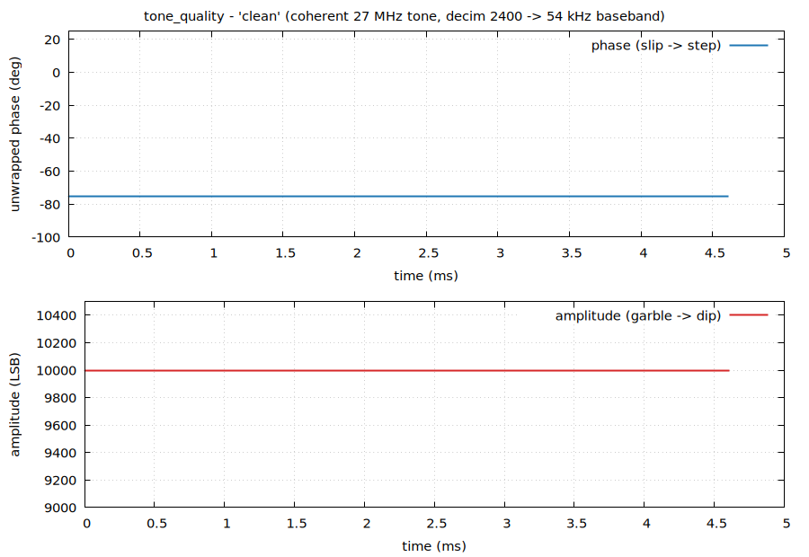
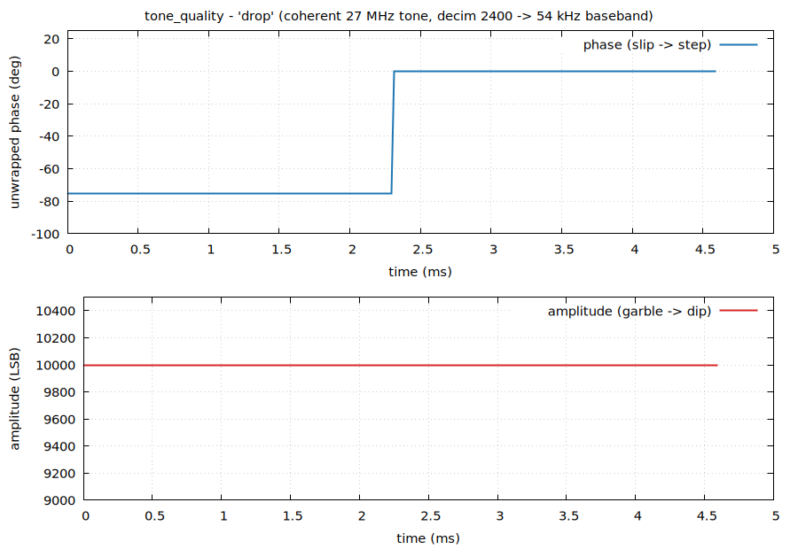
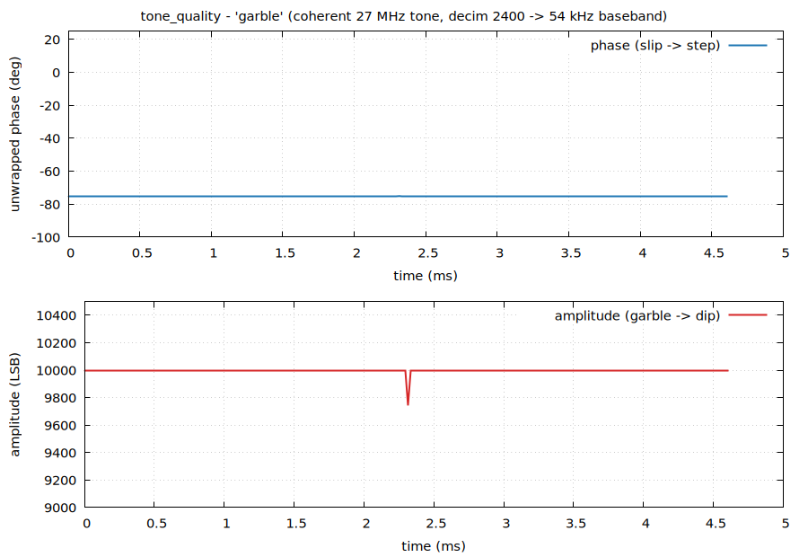

# Coherent-tone data-quality monitor (`tone_monitor` + `tone_quality.py`)

The data-**quality** half of the RX888 measurement campaign. `pps_integrity`
and `stream_soak` prove the stream is *delivered* (no lost/short transfers); this
proves it is *correct* (no dropped, duplicated, or garbled samples). See
`doc/pps_integrity.md` for the delivery side and `doc/tone_monitor_plan.md` for
the design rationale.

Split of labor (the same split that made the PPS work pay off):
- **`src/tone_monitor.c`** runs on the Pi, demodulates the tone INLINE, and
  emits **raw telemetry only — no verdict.**
- **`tests/tone_quality.py`** runs OFFLINE on the saved telemetry and does all
  the interpretation (the verdict lives here, where it can be refined without
  re-running the rig).

## Why a coherent tone (the rig precondition)

A single GPSDO 27 MHz output is split to BOTH the RX888 Si5351 reference AND the
RF input, and the Si5351 uses INTEGER multipliers only (PLL ×24 → 648 MHz VCO →
÷5 → 129.6 MHz; no fractional MultiSynth / delta-sigma). So the tone is exactly
phase-coherent with the sample clock:

```
f_tone / fs = 27 / 129.6 = 5/24   (exact, GPSDO-drift-immune: drift scales
                                    numerator and denominator together)
```

The digitized tone is therefore a deterministic period-24 sequence — a built-in
test pattern the LTC2208 does not provide on its own. A single Goertzel bin at
5/24 demodulates it to a slowly-varying complex phasor; corruption shows up as a
discontinuity in that phasor.

## What corruption looks like

| event | phase | amplitude |
|---|---|---|
| **slip** (dropped/duplicated sample) | persistent **step** of 75°/slipped-sample | unchanged |
| **garble** (bit error / corrupted run) | flat | transient **dip/spike** |
| **benign** GPSDO/PLL/thermal wander | slow, smooth (tracked out) | slow drift |

The 75° comes from `360 × cyc/N = 360 × 5/24`. A slip moves the sample grid one
step relative to the tone, so the recovered phase jumps and *stays* jumped; a
garble corrupts one block's energy then heals.

## The inline tool: `tone_monitor`

```
tone_monitor [hours] --rate 129.6 --ftone 27e6 --decim 2400 \
             --statslog run.csv --iqlog run.iq
```

Single-bin Goertzel at bin `cyc/N` (1 multiply + 2 adds per sample, no
per-sample trig). `--decim` is the block length / decimation and MUST be a
multiple of `N = fs/gcd(fs,ftone)` (so the bin is an exact DFT index and every
block starts at the same LO phase); the tool rejects other values. Two outputs,
both raw measurements:

- **`--statslog FILE`** — per-second CSV. Columns:
  `time,sec,blocks,amp_mean,amp_min,amp_max,resid_freq_hz,max_step_deg,`
  `worst_step_sample,phase_end_deg,` then the firmware GETSTATS counters
  (`dma_count,drain_*,backlog`) and libusb counters (`ok/bad/zero_xfers`,
  `pib,faults,boot`). `max_step_deg` + `worst_step_sample` preserve slip
  evidence even when the per-second mean looks clean. ~MB/hour.
- **`--iqlog FILE`** — the decimated complex baseband as a 48-byte header then
  interleaved `float32 (I,Q)` at `fs/decim`. This IS the demodulated tone, so
  any offline analysis can be redone with no rerun. Default decim 2400 →
  54 kHz → ~1.5 GB/hour, localizes a slip to ~18 µs. iqlog header:
  ```
  char[8] "RX888IQ\0" ; u32 version ; u32 decim ; u32 period_n ; u32 period_cyc
  ; f64 fs_hz ; f64 ftone_hz ; f64 start_unix
  ```
  The phasor is scaled by `2/decim`, so `|I+jQ|` is the tone amplitude in LSB.

### `--source` (hardware-free)

`--source FILE` (or `-` for stdin) drives the SAME `sample_cb`/Goertzel/iqlog
path from raw int16 samples instead of the device, producing the same outputs.
A synthesized waveform thus validates the production DSP with no rig (used by
`tests/tone_monitor_replay.sh`), and captured streams can be replayed.

## The offline analyzer: `tone_quality.py`

```
tone_quality.py run.iq                 # baseband: tracking demod + discriminator
tone_quality.py run.csv                # statslog: per-second summary + candidates
tone_quality.py capture.s16            # raw int16: period-N + DDC + FFT (SINAD)
tone_quality.py run.iq --markers pps_marks.txt   # correlate events vs PPS splices
tone_quality.py run.iq --plotdata run.dat        # dump time series for gnuplot
```

Input type is auto-detected. On the **iqlog** it runs the phase-locked tracking
demodulator: the benign residual carrier is the robust (median) phase slope and
is tracked out, leaving discontinuities. It reports the residual carrier (Hz),
phase jitter (deg RMS, slips removed), near-DC SNR, and a **slip/garble
classification** alongside the raw numbers — a slip is a persistent phase step,
a garble is an amplitude transient with no phase step. On the **statslog** it
summarizes amplitude and residual frequency over time and lists seconds whose
worst phase step looks like a slip (to then inspect in the iqlog).

## Plotting with gnuplot

`tone_quality.py --plotdata FILE` writes the per-record demodulated time series
as plain columns:

```
# record  t_ms  amp_lsb  phase_deg  uphase_deg  dphase_deg
```

gnuplot reads it directly — e.g. unwrapped phase (column 5) and amplitude
(column 3) vs time (column 2):

```gnuplot
set multiplot layout 2,1
set xlabel "time (ms)"
set ylabel "unwrapped phase (deg)";  plot "run.dat" using 2:5 with lines
set ylabel "amplitude (LSB)";        plot "run.dat" using 2:3 with lines
unset multiplot
```

`tests/tone_quality_plots.sh [tone_monitor] [outdir]` automates the whole
pipeline (numpy synth → `tone_monitor --source --iqlog` → `--plotdata` →
gnuplot) for the three synthetic cases. The figures below were produced by it
(no hardware):

| case | what the figure shows |
|---|---|
| clean |  phase flat, amplitude flat |
| drop |  **phase steps 75°** (one grid slip), amplitude flat |
| garble |  phase flat, **amplitude dips** then heals |

The phase panel discriminates the slip; the amplitude panel discriminates the
garble — exactly the two-axis separation the analyzer reports numerically.

## Validation

`tests/tone_monitor_replay.sh` (in `make check`, skips without numpy)
synthesizes clean/drop/garble, runs them through the real `--source` path, and
checks both the iqlog directly and the `tone_quality.py` conclusions:
clean → CLEAN, drop → 1 grid slip (+1 sample, localized), garble → 1 garble
(amplitude dip, no phase step). The DSP is validated end-to-end with no rig; the
only untested path is the device driver, which mirrors the known-good
`stream_soak`.

## Running on the rig

1. Bare-stream tone baseline (confirm CLEAN):
   `tone_monitor 1 --statslog base.csv --iqlog base.iq` then
   `tone_quality.py base.iq`.
2. Long soak with the PPS marker running, then correlate corruption events with
   the marker splices via `--markers`.
